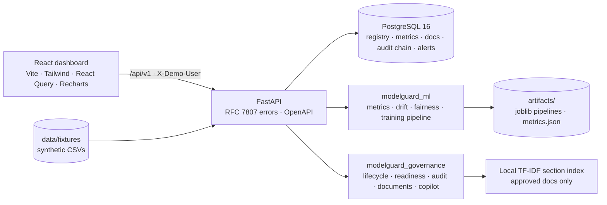

# ModelGuard — governed credit-risk model lifecycle platform

> **Portfolio simulation.** ModelGuard trains, validates, approves, monitors and documents a probability-of-default
> (PD) model on a **synthetic** loan-performance fixture. It is **not a lending system, not credit advice, and makes
> no claim of compliance with any regulation or any bank's governance framework.** Nothing here connects to a real
> bank, bureau, customer or borrower.

ModelGuard brings four normally-fragmented workflows into one local-first application:

1. **Train and evaluate** an explainable PD model (logistic baseline vs. gradient-boosted champion) on a temporal holdout with bootstrap confidence intervals, calibration, threshold analysis, feature importance, a documented hypothesis test and fairness diagnostics.
2. **Register immutable model versions** with lineage (source → snapshot → training run → version), eight versioned governance documents, a control matrix, a deterministic **readiness gate** that names every missing piece of evidence, a human-only approval step, and a **hash-chained, append-only audit log**.
3. **Monitor** dated batches for data quality, feature/score drift (PSI), calibration and performance, with an alert → investigate → resolve workflow.
4. Ask a **retrieval-grounded governance copilot** what is missing before approval. It reads only that version's approved documents, cites document sections, returns a validated JSON structure, and works fully offline with a deterministic rule-based provider.


## Quick start

**Docker (PostgreSQL 16, one command):**

```bash
docker compose up --build
```

Dashboard: http://localhost:8080 · API + OpenAPI: http://localhost:8000/docs. The API container applies migrations and, if the registry is empty, seeds the demo (three model versions, three monitoring batches, alerts) — about 20 s.

**Local (SQLite, hot reload):**

```bash
make setup      # uv venv + Python deps + npm install
make seed       # migrations + demo registry
make dev        # API on :8000 and dashboard on :5173
```

Requirements: Python 3.12+ (uv installs 3.13), Node 20, Docker (optional). No API key is needed; set `MODELGUARD_LLM_PROVIDER=anthropic` and `ANTHROPIC_API_KEY` in `.env` to try the hosted copilot provider (it still never sees loan rows).

Acting as a user: the dashboard's **Acting as** menu switches between the seeded demo users `data_scientist`, `reviewer` and `risk_leader`; API calls send the `X-Demo-User` header, and every authorisation check is enforced server-side.

## What to look at (the PRD's success criteria)

| # | Criterion | Where |
| --- | --- | --- |
| 1 | Dataset source, license, schema, checksums, data-quality results | Version page → Lineage; `docs/data-sources/synthetic-loans-v1.md`; `GET /api/v1/snapshots/{id}` |
| 2 | Reproducible training, champion vs. baseline | Validation page → holdout table; `training_runs.config_json` stores seed, features, hyperparameters, package versions, data checksum, git SHA |
| 3 | AUC, KS, Brier, calibration, CIs, fairness | Validation page (ROC, calibration curve, confusion matrix, threshold analysis, fairness table, KS test) |
| 4 | Model card and validation report tied to one immutable version | Version page → Model card; Governance page → Documents (download as Markdown) |
| 5 | Incomplete version blocked with specific missing evidence | Governance page for `pd-credit-v1.2.0` as *Data scientist* → **Submit for review** → 409 listing every gap |
| 6 | Human approval as reviewer, append-only audit event | Governance page for `pd-credit-v1.1.0` as *Model risk reviewer* → rationale → **Approve**; Version page → Audit log; `GET /api/v1/audit-events/verify` |
| 7 | Dated monitoring batch with quality, drift, calibration, performance alerts | Monitoring page for `pd-credit-v1.0.0` (Q1 stable → Q2 investigate → Q3 alerts); resolve an alert with a note |
| 8 | Copilot returns a structured, cited answer | Governance page → Governance copilot; `POST /api/v1/model-versions/{id}/copilot/query` |
| 9 | Tests and CI | `make ci` (lint, types, tests, secrets scan); `.github/workflows/ci.yml` also runs Postgres migrations, Playwright e2e, gitleaks and Docker builds |

A three-minute walkthrough is in [docs/demo-script.md](docs/demo-script.md).

## Measured results (seeded demo run, synthetic fixture)

All numbers below are read from the seeded database by `make executive-pack` / `make test` — none are typed in. Re-run to refresh them; they will change if the fixture generator or model code changes.

| Item | Value |
| --- | --- |
| Data | 1 source, 4 snapshots (1 training, 3 monitoring); 6,000 training rows over 24 monthly cohorts; temporal split 3,437 / 1,262 / 1,301 (train / validation / test) |
| Champion (`HistGradientBoosting`) holdout | AUC **0.764** [0.723, 0.801] · KS 0.409 [0.357, 0.488] · Brier 0.0832 · ECE 0.0086 |
| Baseline (logistic) holdout | AUC 0.771 [0.732, 0.809] · KS 0.410 · Brier 0.0828 · ECE 0.0134 |
| Fairness diagnostics (synthetic group) | selection-rate ratio 0.857 · TPR diff 0.072 · FPR diff 0.010 |
| Registry | 3 model versions (MONITORING / PENDING_REVIEW / VALIDATED-blocked), 2 training runs, 8 readiness checks, 6 controls, 8 documents per version |
| Readiness gate | complete versions 8/8 pass; the incomplete version fails 6 of 7 review-blocking checks with 22 named gaps |
| Monitoring | 3 batches; 8 induced alerts (4 high, 4 medium): PSI on `debt_to_income` 1.27, `interest_rate` 3.43, `employment_length` 0.35, score PSI 1.41; 1 resolved, 1 investigating |
| Audit | 127 hash-chained events on the Postgres seed; chain verifies |
| Copilot | rule-based provider scores **8/8 (100%)** on the hand-authored completeness set (`tests/fixtures/copilot_eval.json`); hosted providers not measured (no key in CI) |
| Tests | 115 pytest (95 unit incl. the copilot eval + 20 integration; 1 hosted-provider eval skipped without a key) + 5 Playwright e2e; **93% line coverage** overall — `modelguard_governance` 96%, `modelguard_ml` 95%, API 92% (lifecycle and audit modules 100%) |
| Latency (local SQLite, p50 / p95) | version detail 7 / 9 ms · monitoring 8 / 8 ms · executive summary 38 / 40 ms · copilot query 51 / 65 ms · portfolio 107 / 198 ms (re-runs the readiness engine incl. secrets scan) |
| Dashboard load (Vite dev, network idle) | 0.6–0.9 s per page |

Source: `docs/executive/measured-demo-metrics.json`, `docs/executive/risk-memo.md`, `docs/executive/five-slide-deck.md`.

## Architecture



Lifecycle: `DRAFT → VALIDATED → PENDING_REVIEW → APPROVED → MONITORING → RETIRED`, with `REJECTED` reachable from review or approval and `REOPEN` back to draft. Only `reviewer` can approve/reject/retire; only `data_scientist` can train, validate, edit narrative/controls or submit; nothing is modifiable after submission; every transition is an audit event.

Key decisions are recorded in [docs/architecture/decisions](docs/architecture/decisions/README.md): dataset & license (synthetic fixture now; a real dataset needs a human to confirm its license), HistGradientBoosting over XGBoost, temporal split, target/leakage controls, permutation importance instead of SHAP, TF-IDF retrieval with a mandatory offline provider, and configurable (not policy) monitoring thresholds.

## Repository layout

```
apps/api/        FastAPI app, SQLAlchemy models, Alembic migrations, services, demo seed
apps/web/        React + TypeScript dashboard, Playwright e2e
packages/ml/     metrics, drift, fairness, data quality, splits, training, synthetic data, adapters
packages/governance/  lifecycle state machine, readiness engine, audit chain, documents, copilot
packages/shared/ hashing, constants, JSON sanitising
data/fixtures/   synthetic training set + 3 monitoring batches      data/sources/  (git-ignored) licensed raw files
docs/            ADRs, data-source docs, governance templates, generated per-version docs, executive pack, screenshots
tests/           unit, integration (SQLite or Postgres), copilot eval fixtures
infra/docker/    Dockerfiles, nginx config, entrypoint (migrate + seed)
```

## API

All endpoints live under `/api/v1` and are documented at `/docs`. Highlights: `POST /data-sources`, `POST /snapshots/import`, `POST /training-runs`, `POST /model-versions`, `POST /model-versions/{id}/validate | submit-review | decision | retire | reopen`, `PUT /model-versions/{id}/narrative | controls`, `GET /model-versions/{id}/documents/{type}[/download]`, `POST /model-versions/{id}/monitoring-batches`, `GET /model-versions/{id}/monitoring`, `PATCH /model-versions/{id}/alerts/{alert_id}`, `POST /model-versions/{id}/copilot/query`, `GET /executive-summary/{id}`, `GET /portfolio`, `GET /audit-events[/verify]`.

## Development

```bash
make test          # pytest with coverage (SQLite, offline)
make lint          # ruff + eslint          make typecheck   # mypy + tsc
make e2e           # Playwright (needs a seeded API on :8000 and `npx playwright install chromium`)
make secrets-scan  # local scan; CI also runs gitleaks
make executive-pack  # regenerate memo + deck from the database
make fixtures      # regenerate synthetic CSVs deterministically
```

Conventions for contributors (and for Claude Code) are in [CLAUDE.md](CLAUDE.md).

## Ethical boundaries

No PII, no scraped or unlicensed data, no real lending decisions, no automated approvals, no borrower-level rows in the UI/logs/prompts, and no compliance claims. See the PRD's non-goals and ADR-0001.

## License

MIT. The synthetic fixture is generated in-repo and carries the same license.
